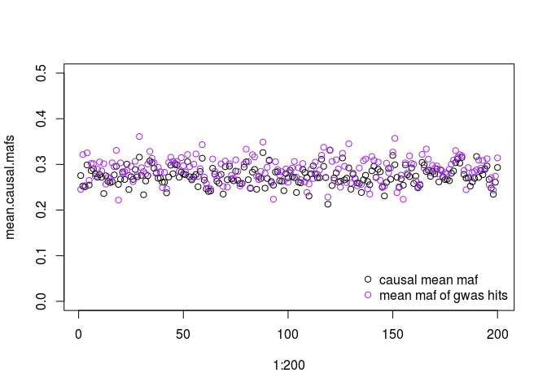

# gwas_simulator
em  
November 6, 2016  


Is there actually a bias towards detecting intermediate allele frequencies in GWAS? Let's find out. Running a basic simulation with 1 population.

What we want out is the relationship between MAF of causal alleles going in and the MAF detected coming out.

Code for one simulation:

```r
n=1
loci=100
pop = 500

gwas_sim <- function(pop, loci, n){
x1 <- runif(1) #getting a random number so there's a seed
#save(".Random.seed", file=paste("gwas_sims/randomSeed.",n, sep=""))

#I'm starting with a uniform distribution of allele frequencies, which is obviously unrealistic, but lets us examine variation between different frequencies more easily.
allele.frequencies = runif(loci, min=0, max=1) 
beetas = matrix(c(rnorm(loci/2),rep(0,loci/2)), ncol=1, nrow=loci) #half are 0, half are from a normal distribution

#to get the individual genotypes, first make a matrix with a row for each individual, column for each locus, value is the underlying allele frequency of the population
ind.freqs = t(matrix(rep(allele.frequencies, pop), ncol = pop))
#then sample to get the genotypes.
pop.genotypes = apply(ind.freqs,c(1,2), function(x){sum(sample(c(1,0),2,replace=TRUE, prob = c(x,1-x)))} )
pop.phenotypes = pop.genotypes %*% beetas
real.freqs = colSums(pop.genotypes)/(pop*2) #getting the observed frequency
#hist(pop.phenotypes)

#do the GWAS
doGWAS <- function(x){
  if (real.freqs[x] > 0.05 & real.freqs[x] < 0.95){ 
    out.matrix = summary.lm(lm(pop.phenotypes~pop.genotypes[,x]))$coefficients }
  else {
    out.matrix = matrix(c(rep(NA,7),1), ncol=4)}
  return(out.matrix)
}

gwas.tables = sapply(1:loci, doGWAS)
gwas.pvals = gwas.tables[8,]
gwas.betas = gwas.tables[2,]

get.maf = function(f){
if (f>0.5) {my.maf = 1-f}
else {my.maf = f}
return(my.maf)
}

initial.mafs = sapply(real.freqs, get.maf)
assoc.mafs = initial.mafs[gwas.pvals < 0.05]
causal.mafs.all = initial.mafs[0:50]
causal.mafs = causal.mafs.all[causal.mafs.all > 0.05]

return(list(causal.mafs,assoc.mafs))
}
```


Try running 10 times and compare causal mafs with association mafs.


```r
gwas.sims.200 = sapply(1:200, function(x){gwas_sim(500,100,x)})

mean.causal.mafs = sapply(gwas.sims.200[1,], mean)
mean.assoc.mafs = sapply(gwas.sims.200[2,],mean)

plot(1:200, mean.causal.mafs, ylim = c(0,0.5))
points(1:200, mean.assoc.mafs, col = "purple")
legend('bottomright', c('causal mean maf', 'mean maf of gwas hits'),bty="n", col = c("black","purple"), pch=1)
```

<!-- -->

```r
hist(mean.assoc.mafs - mean.causal.mafs, col="mediumpurple3", border="white")
```

<!-- -->

OK so clearly a skew towards intermediate allele frequencies. There are a potential issues here. First, I assume a uniform distribution of allele frequencies which is obviously inaccurate. Second, I'm not really getting at my false-positive or false-negative rate with this summary. Third, I chose a p value cut-off of 0.05, which is maybe too high. Also, there is probably a better way to plot this.

How much worse is it with a smaller population size?

```r
gwas.sims.pop100 = sapply(1:200, function(x){gwas_sim(100,100,x)})
mean.causal.mafs = sapply(gwas.sims.pop100[1,], mean)
mean.assoc.mafs = sapply(gwas.sims.pop100[2,],mean)

plot(1:200, mean.causal.mafs, ylim = c(0,0.5))
points(1:200, mean.assoc.mafs, col = "purple")
legend('bottomright', c('causal mean maf', 'mean maf of gwas hits'),bty="n", col = c("black","purple"), pch=1)
```

<!-- -->

```r
hist(mean.assoc.mafs - mean.causal.mafs, col="mediumpurple3", border="white")
```

<!-- -->
